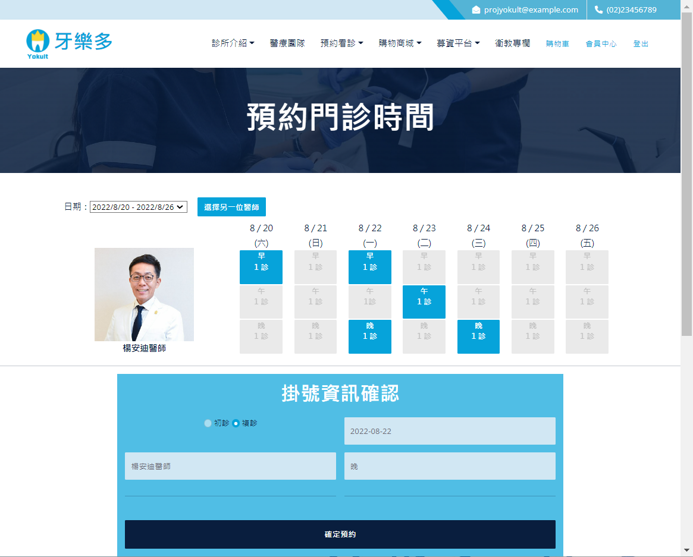
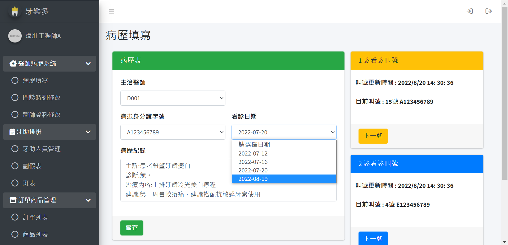

[🇺🇸 English](#english) | [🇹🇼 中文版](#chinese)

# 🦷 Dentist API (SpringBoot)

|    Foreground - Appointment booking system        |  Background -  Doctor management system e.g.medical record     |
| :-----------------------------------------:       | :-----------------------------------------: |
|      |  |

A comprehensive dental clinic management system featuring a patient booking frontend and a doctor's medical record backend.

### 🎥 Demo Video

[Project Introduction on YouTube](https://youtu.be/WA7HqjGuXJ4)

### ✨ Core Features

* **Patient Frontend (Booking):** Online appointment booking system (Frontend & Backend).
* **Real-time Sync:** Clinic schedule automatically updates and syncs with the backend management system.
* **Doctor Backend (Doctor):** Electronic medical record (EMR) management system (Frontend & Backend).

### 🛠️ Tech Stack

* **Framework:** SpringBoot, Spring Web MVC
* **Security:** JWT (JSON Web Token)
* **Database:** MySQL, MongoDB, Hibernate (ORM)
* **Build Tool:** Maven

### 🚀 Version Update

* **Refactoring:** Upgraded the legacy Version 1.1 (Servlet API) to the modern **SpringBoot** framework to enhance maintainability and performance.

*Update by Vicky Tsai* 😊

---

[🇺🇸 English](#english) | [🇹🇼 中文版](#chinese)

# 🦷 牙醫診所系統 API (SpringBoot)

|                前台 - 病患掛號網頁                |            後台 - 醫師管理系統 (圖以病歷為例)               |
| :-------------------------------------------: | :---------------------------------------------------------: |
|  |  |

完整的牙醫診所管理系統，包含病患掛號前台與醫師病歷後台。

### 🎥 專案展示

[作品介紹影片 @YouTube](https://youtu.be/WA7HqjGuXJ4)

### ✨ 系統功能

* **病患掛號前台系統 (Booking)：** 提供完整的線上掛號服務 (含前後端)。
* **時刻表連動：** 門診時刻表與後台系統即時連動更新。
* **醫師後台系統 (Doctor)：** 獨立的病歷管理後台 (含前後端)。

### 🛠️ 技術選型

* **核心框架：** SpringBoot, Spring Web MVC
* **資安驗證：** JWT (JSON Web Token)
* **資料庫：** MySQL, MongoDB, Hibernate (ORM)
* **建置工具：** Maven

### 🚀 改版資訊

* **架構重構：** 將 version 1.1 使用的 Servlet API 全面升級為 **SpringBoot** 框架技術，提升系統效能與可維護性。

*Update by Vicky Tsai* 😊

---
